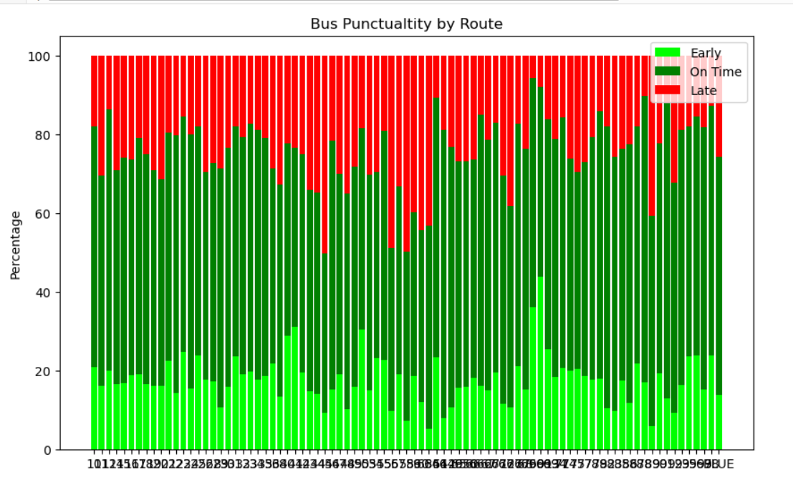

# Winnipeg-Transit-System

## Project Goals

We are Analyzing the City of Winnipeg's Transit Performance

Getting Insights from the Transit Performance and Proposing Business Solution to City Transit.

Data is taken from https://info.winnipegtransit.com/en/open-data/about/

Files taken:

 - Estimated_Daily_Passenger_Activity (CSV):
                                  Daily Passengers travelling for all routes thorughout the city.

 - Transit_on_time_performance (CSV):
                                  Stop information for all the Routes regarding if the bus was "On Time", "Early" or "Late" as per the Schedule.

 - Transit_pass(CSV):
                                  Times when passengeres were declined the boarding for bus when the bus was full.

 - Transit(CSV):
                                  Times when passengers with wheel chair were denied boarding when bus was full.

Analyzing Data in Python:
                       Performing EDA and Model Building.

Tableau:                       
                       Creating Dashboard to simplify and visualizing data for better Understanding.

## Process

### Transit_on_time performance:

---> Analysing relationship between Early Stops, On-Time Stops and Late Stops.

  

---> As shown Early Stops and On-Time Stops are correlated:
                                                          As On-Time Stops increases the Early-Stops increases as well

---> Analyze Transit Performance between Summer 2022 and Summer 2023

    Creating a stacked bar Chart to show punctuality of bus schedule.

    Grouping data for each route station showing the average ('Early Stops, Late Stops, On-Time Stops) along with their percentage over the year

    Use the Grouped data to plot the graph to find the perecentage of Bus on time performance for each route
                                                            

  

Note:  The same graph can be created in Tableau for Simplifying. 
   