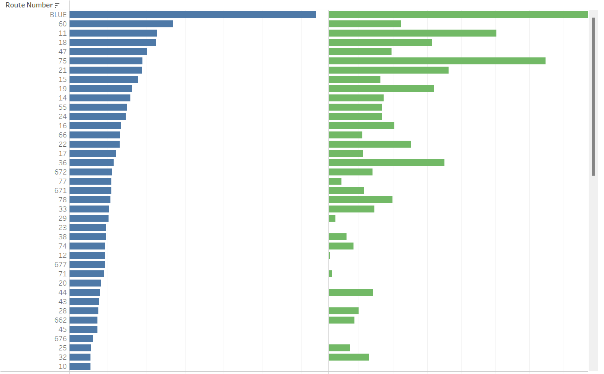
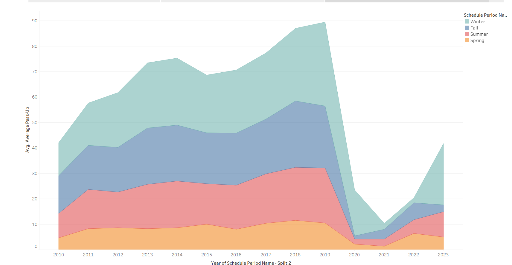
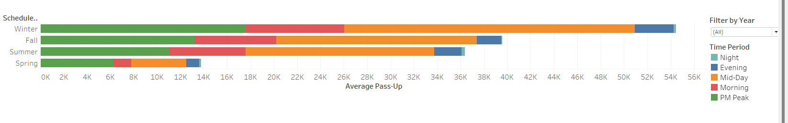

# Winnipeg-Transit-System

## Project Goals

We are Analyzing the City of Winnipeg's Transit Performance

Getting Insights from the Transit Performance and Proposing Business Solution to City Transit.

Data is taken from https://info.winnipegtransit.com/en/open-data/about/

Files taken:

 - Estimated_Daily_Passenger_Activity (CSV):
                                  Daily Passengers travelling for all routes thorughout the city.

 - Transit_on_time_performance (CSV):
                                  Stop information for all the Routes regarding if the bus was "On Time", "Early" or "Late" as per the Schedule.

 - Transit_pass(CSV):
                                  Times when passengeres were declined the boarding for bus when the bus was full.

 - Transit(CSV):
                                  Times when passengers with wheel chair were denied boarding when bus was full.

Analyzing Data in Python:
                       Performing EDA and Model Building.

Tableau:                       
                       Creating Dashboard to simplify and visualizing data for better Understanding.

## Process

### Transit_on_time performance:

---> Analysing relationship between Early Stops, On-Time Stops and Late Stops.

  

---> As shown Early Stops and On-Time Stops are correlated:
                                                          As On-Time Stops increases the Early-Stops increases as well

---> Analyze Transit Performance between Summer 2022 and Summer 2023

    Creating a stacked bar Chart to show punctuality of bus schedule.

    Grouping data for each route station showing the average ('Early Stops, Late Stops, On-Time Stops) along with their percentage over the year

    Use the Grouped data to plot the graph to find the perecentage of Bus on time performance for each route
                                                            

  

Note:  The same graph can be created in Tableau for Simplifying. 
   

## Joining Data and Modelling

### Route Numbers for Data

(1) Daily_passenger Data : 113 Route Numbers

(2) On_Time Data: 85 Route Numbers

---> For further analysis and modelling for joined data we will be taking only common Route Numbers for both the files.

---> We also join the Pass-ups for passangers and Pass-ups for wheelchair passengers

#### We merge all the dataframes together for analysis and Modelling.

Note: See https://github.com/pchaudhary12/Winnipeg-Transit-System/tree/main/python_code for source code.

## Further Insights

---> We are also to notice that there is a conceteration of transit demand/Boarding on some
routes than on the others, which makes pass up more pronounced in some routes

---> More pass ups occur during the winter season and we want to understand the reason why
more passengers are left behind relates to season

Note: There is Sudden drop from 2020 to 2022 because of Covid-19

---> Winter has the most demand for the transport system. This is why the it has the most average pass ups

---> For Complete Dashboard Check: https://github.com/pchaudhary12/Winnipeg-Transit-System/tree/main/tableau

---> With More more data can be gathered and get insights through different visaulization and also make more improvisation.

